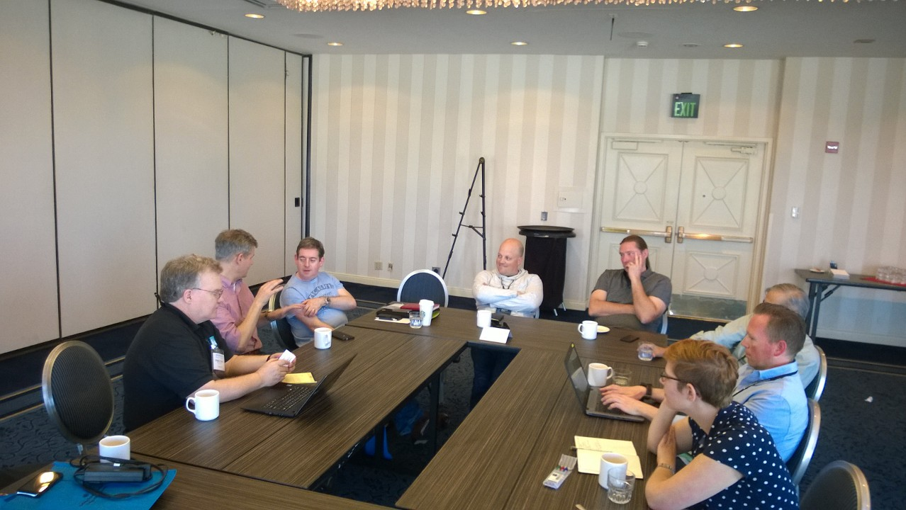

# SATURN 2016 Workshop on Containers and Software Architecture

Write once run anywhere.  Over the years many technologies and design paradigms have made this promise.  Virtual containers such as Docker and CoreOS may finally be the technology that truly delivers on the promise.  But with all new powers developers must be prepared for a new set of responsibilities.  Containers may bring portability but with it comes new abstractions.  Scalability might be achievable but only when certain patterns are followed.  Like all the magic that came before it, an improper understanding of the abstractions underneath brings calamity.

The workshop took place on Monday, May 2, 2016 in San Diego, CA as part of the [SATURN 2016 conference on software architecture](http://www.sei.cmu.edu/saturn/2016/).

## Workshop Outcomes

The workshop was conducted as a series of discussions following [this general ageneda](agenda.md).

* [Initial Topic List](outcomes/topic-brainstorm.md)
* Discussion 1: [What is a container?](outcomes/what-is-a-container.md)
* Discussion 2: [Container Orchestration](outcomes/container-orchestration.md)
* Discussion 3: [Containers: Past, Present, and Future](outcomes/containers-past-present-future.md)
* [End of Workshop Summary](outcomes/summary.md) -- created by the group at the end of the day

## Workshop Participants

Participants were asked to submit a [position paper](how-to-join.md#position-papers) before the conference to help prepare for discussions.  Those papers are listed below.

* Clay Baenziger - [Basis of Containers](position-papers/baenziger-containers-basis.md)
* Dennis Mancl - [The Relationship of Containers and Software Testing](position-papers/mancl-relationship-of-containers-and-software-testing.md)
* Eoin Woods, [@eoinwoodz](https://twitter.com/eoinwoodz) - [Containers as Architectural Elements - better zip files or a new architectural style?](position-papers/eoinwoods-containers-as-architectural-elements.md)
* George Fairbanks [@GHFairbanks](https://twitter.com/GHFairbanks) - [An IT Application Developer's Perspective on Containers](position-papers/George Fairbanks - An IT Developer's Perspective on Containers.md)
* Harald Wesenberg, [@hwes](https://twitter.com/hwes) [Using containers to keep costs down while maintaining security](position-papers/Harald-Wesenberg-Using-containers-to-keep-costs-down-while-maintaining-security.md )
* Jenny Manning [@j41manning](https://twitter.com/j41manning) - [Containers: For Better or Worse](position-papers/manning-containers-for-better-or-worse.md)
* Jørn Ølmheim - [Containers - Enabler of DevOps](position-papers/joe-containers-enabler-of-devops.md)
* Kurt Stam [@KurtStam](https://twitter.com/KurtStam) - [Cloud-in-a-box](position-papers/kurt-stam-cloud-in-a-box.md)
* Len Bass - [Len Bass's Position Paper](position-papers/Len Bass - position paper for SATURN 2016.pdf)
* Michael Keeling, [@michaelkeeling](https://twitter.com/michaelkeeling) - [Our Understanding of the Allocation Style is Out of Date](position-papers/keeling-our-understanding-of-allocation-patterns-is-out-of-date.md)

**Workshop Organizers**

* [George Fairbanks](https://github.com/georgefairbanks) | [@GHFairbanks](https://twitter.com/GHFairbanks)
* [Michael Keeling](https://github.com/michaelkeeling) |  [@michaelkeeling](https://twitter.com/michaelkeeling) | [http://neverletdown.net](http://neverletdown.net)

Thanks to everyone who participated in this year's workshop!  Not pictured below are Clay and Michael.

## About SATURN

The 12th SEI Architecture Technology User Network (SATURN) Conference brings together influential leaders and experts in software design to discuss architecture-centric practices for developing, acquiring, and maintaining software-reliant systems. Developers and architects from more than 20 countries meet annually at SATURN to share ideas, network, and learn about new and existing technologies. For more information, go to [http://www.sei.cmu.edu/saturn/2016](http://www.sei.cmu.edu/saturn/2016).

- [SATURN 2016 Program](http://www.sei.cmu.edu/saturn/2016/program.cfm)
- [SATURN 2016 Registration](http://www.sei.cmu.edu/saturn/2016/registration.cfm)
- [SATURN Archives](http://www.sei.cmu.edu/saturn/2016/presentations.cfm)
- [SATURN 2015 Workshop on Microservices](https://github.com/michaelkeeling/SATURN2015-Microservices-Workshop)

