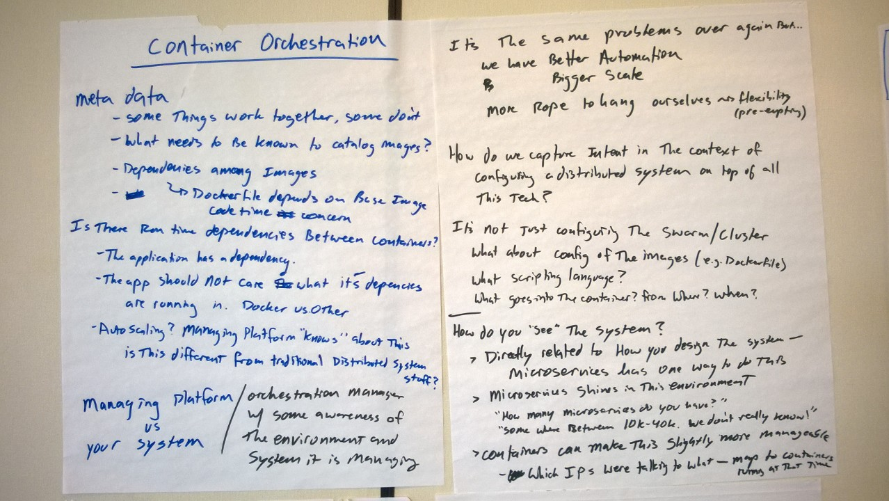
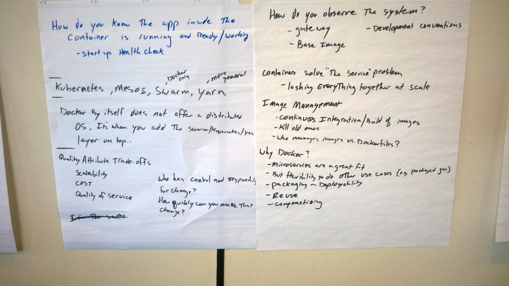
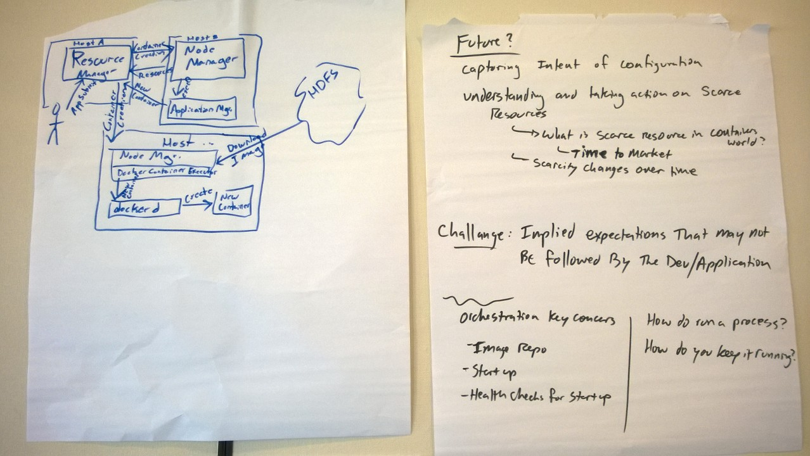
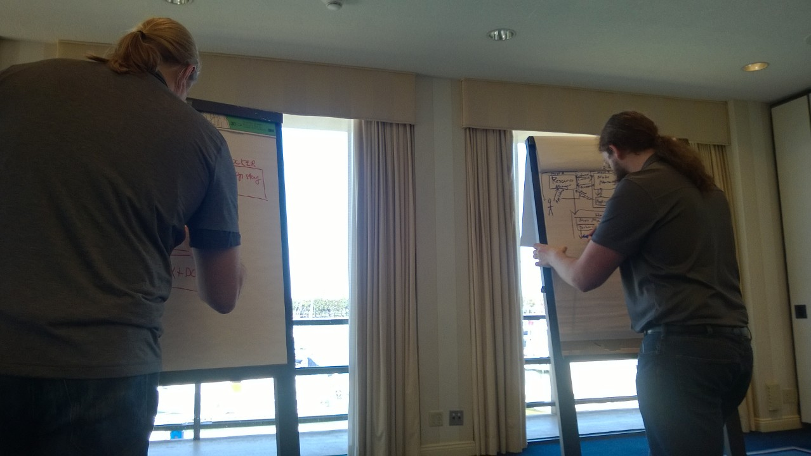
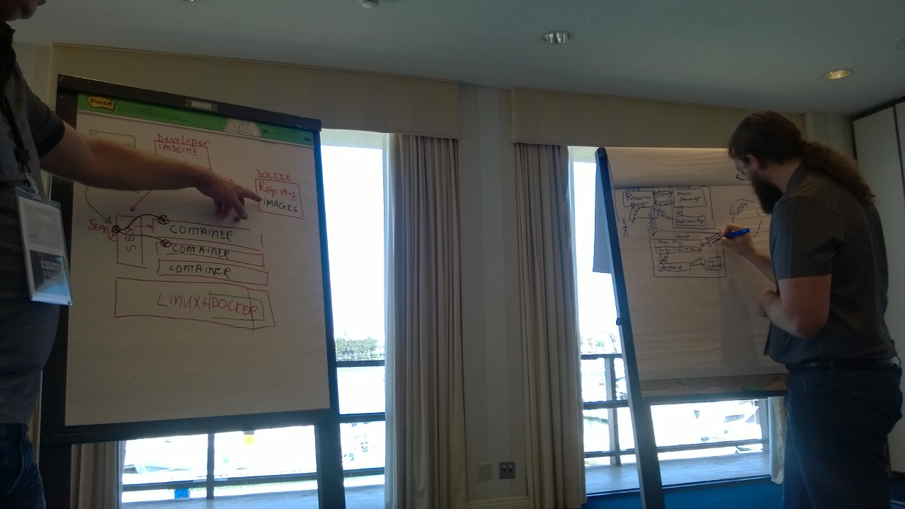
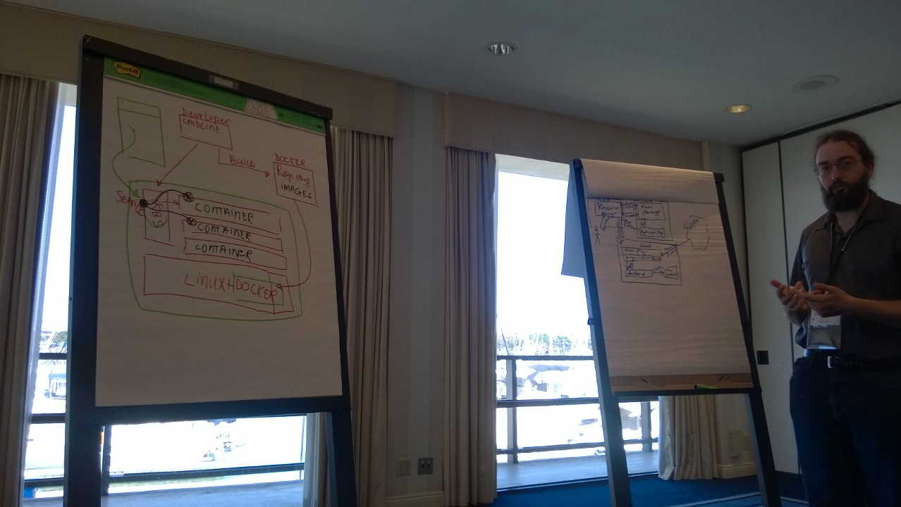

# Container Orchestration

Meta  data

* Some things work  together, some don’t.
* what needs to be known to catalog images?
* dependencies among images. Dockker file depends on base image code time concern
* Is there run time dependencies between containers?
* the application has a dependency
* the app should not care what its dependencies are running - Dockker vs other
* auto scaling? Managing platofrm knows about this. Is this different from trandition distributed system stuff

Managing platform - distribute orchestration manger awareness of the environment and the system it  is  managing.

How do you know the app inside the container is running and ready/working - start up health check

Kubernetes, Meses, Swarm (Docker  only), Yarn (more general)

Docker by itself does not offer a distributed OS, its when you add the Swarm/Kubernetes/Yarn layer  on top.

Quality attribute trade offs: scalability, cost, quality of service, who has control and responsibility for change, how quickly can you make that change.

Its the same problems over agian but we have better automation. Bigger  scale.  More rope  to hang ourselves vs felibility (pre-empting)

How do we capture intent in the context of configuring a distributed system on top of all this tech?

Its not just configuration the Swarm/Cluster. What  about config of the images (e.g. Dockerfile)

What about config of the images

What scripting language

What goes into the container run when where

Do you see the system

* Directly related to how you design the system - microservices does one way to do 
* microservices ?? in the environment
* “how many microservices do you have?” somewhere between 10K-40K, we don’t really know”
* containers can make this slightly more manageable
* Which iPs were likely to what - map to containers running

How do you observe the system- gateway,  development conventions, base image

Containers solve “the service” problem - lashing everything together at scale

Image management

* Continuous integration/build of images
* Kill old ones
* Who manages images vs Dockerfiles

Why Docker? 

* Microservices are a great fit
* But fixability to do other use cases e.g. packed gcc)
* Packaging ~ deployability
* Reuse 
* Componentizing

The Future?

* Capturing the intent of configuration
* Understanding and taking action on scarce resources
* What is a scarce resource in the containers world?
* Time to market?
* Scarcity changes over time
* Challenge: implied expectations that may not be followed by the developer or application
* Orchestration key concerns:
   * Image repository
   * Startup 
* Health checks for startup time
* How to run a process?  How to do you keep it running?

