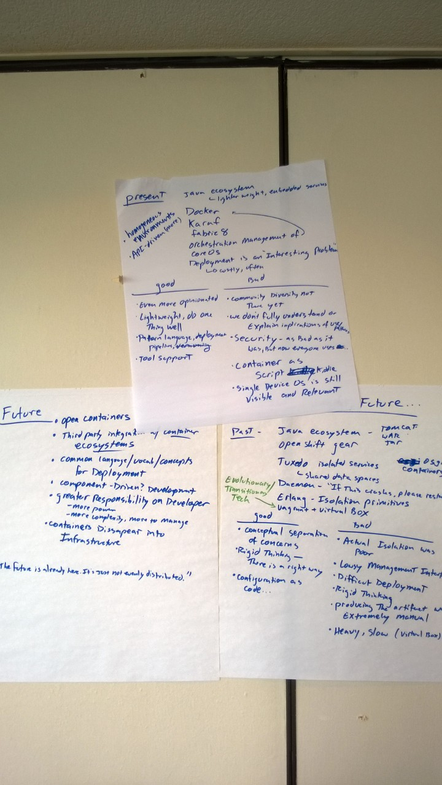

# Past, present, future of containers

## Past:
 - Java ecosystem (Tomcat, WAR, Jar)
 - Openshift gear
 - Tuxedo (isolated services, shared data spaces)
    * running things as daemons, "If this crashes, please restart"
 - OSGi containers
 - Erlang - isolation primitives
 - Vagrant + VirtualBox (an evolutionary/transitionary technology - leading to Docker)

### Good

* conceptual separation of concerns
* rigid thinking - there is a right way
* configuration as code...

### Bad

* actual isolation was poor 
* lousy management interfaces
* difficult deployment
* rigid thinking
* producing the artifact was extremely manual
* heavy, slow (especially VirtualBox)

## Present:
 - Java ecosystem - lighter weight, embedded services
 - Docker
 - Karaf
 - Fabric8
 - Orchestration management of Docker
 - CoreOS
 - Deployment is an "interesting problem" - costly

Present tools are based on homogeneous environments (Linux)
 - they are also API-driven

### Good

* even more opinionated
* lightweight, do one thing well
* pattern language, deployment pipelines
* tool support

### Bad

* community diversity is not there yet
* we don't fully understand or explain implications of use/patterns
* security - as bad as it was before, but now everyone is using the same base components
* container as script kiddie
* single device OS is still visible and relevant

## Future:
 - open containers
 - thrid party integration with container ecosystems
 - common language, vocabulary, concepts for deployment
 - component-driven development
 - greater responsibility on developer
   - more power
   - more complexity, more to manage
 - containers disappear into the infrastructure

"The future is already here. It's just not evenly distributed."

