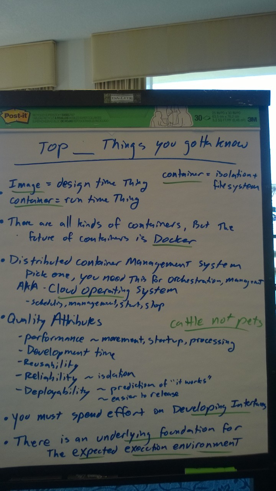
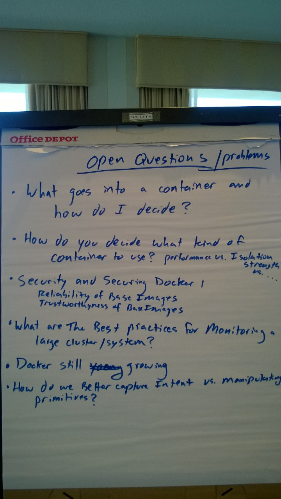

# Containers - Key Ideas

The software ecosystem is evolving.  It is going beyond a simple "cloud environment" of collaborating virtual machines.  The new model includes at least three new technologies:

- microservices architectures
- container frameworks (Docker, Rocket)
- distributed container management systems (Kuburentes, Yarn, Swarm, MESOS)

Microservices is an evolution of SOA -- much smaller services with much simpler APIs and infrastructure.  Systems developed with a microservices-based structure are more flexible... they fit with a new DevOps-centric culture.

Container frameworks are a way to build small "images" that can be executed in a standard container environment - controlled by a Docker daemon running on a Linux platform.  This works very well with Linux virtual machines running in a cloud, but it is useful in other environments as well.  Containers have good "isolation" (they run with their own private file system on the platform and their own private network connections), and they are very quick to start up (much faster than spinning up a new virtual machine).

Distributed container management systems are a good way to deploy a complex set of services, by automating the deployment of Docker containers.  These container management systems (Kuburentes, Yarn, Swarm, MESOS) convert high-level service requests into the startup of Docker containers -- and they might be managing a network of 10000 machines.

Critical enabler for making these technologies work:
 - Growth of open source assets
 - Patterns and techniques for how to do deployments
   - feature toggles
   - continuous integration and red/green development
   - automated deployment using scripts

Is this the 4GL of infrastrcture?  Do we know what is going on inside the system?

In the future, containers may disappear into the infrastructure.

You shouldn't have to type commands into a machine to configure it. It should be done by a script.

## If you were teaching a course, what would you teach about containers?

The top 6 things you have to know:

1. container definition

Container = Isolation + file system

* Image = a design-time thing
* Container = a run-time thing

2. There are all kinds of containers, but the future of containers is Docker

3. You need a Distributed Container Management System - pick one, you will need it for orchestration management
 - it is a kind of "cloud operating system"
 - is does the scheduling, managing, stopping, running health checks, managing network connnections

4. Quality attributes that we are promoting with container
 - performance (movement, startup time, and processing)
 - development time
 - reusability (isolation helps us reduce development time, easier testing)
 - reliability (isolation reduces the damage of a single failure)
 - deployment time (easier to release)

Containers are cattle, not pets -- you are ready to kill them off without a regret...

5. need to spend effort on designing/developing interfaces

6. there is an underlying foundation for the components - the expected execution environment

## Open questions

- What goes into a container and how do I decide?

- How do you decide what kind of container nto use?  (performance versus isolation strengths vs....)

- Security and securing docker
  - reliability of base images
  - trustworthiness of base images

- What are best practices for monitoring a large cluster/system?

- Docker is still growing

- How do we better capture intent vs. manipulating primitives?

