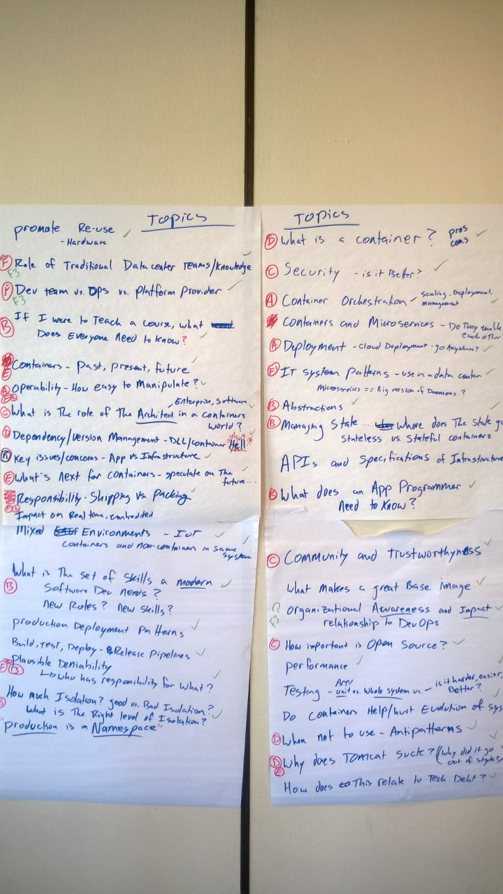
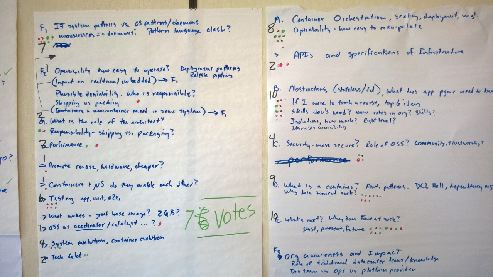

# Containers Workshop: initial brainstorming

1. What is a container? [D]
2. Security - is it better in a container-based system? [C]
3. Container orchestration - scaling, deployment, management [A]
4. Containers and Microservices - do they enable each other?
5. Deployment - cloud deployment - does this enable software to "go anywhere"? [A]
6. IT system patterns - how we build systems that work in the data center ... microservices may be a "big version of daemons" [F1]
7. Abstractions [B]
8. Managing state ... where does the state go? stateless versus stateful containers [B]
9. APIs and specifications of infrastructure
10. What does an application programmer need to know? [B]
11. Community and trustworthiness [C]
12. What makes a great Base Image?
13. Organizational awareness and input -- relationship to DevOps [F3]
14. How importat is Open Source in the world of containers? [C]
15. Performance
16. Testing - unit test versus whole system test versus application test in a real environment
17. Evolution problem - do containers help or hurt?
18. When not to use containers - antipatterns [D]
19. Why does Tomcat suck? (why did it go out of style?) [D][E]
20. How does this relate to technical debt?
21. Promoting re-use (similar to reuse of hardware)
22. Role of traditional data center teams and knowledge [F3]
23. Dev team vs. Ops vs. Platform provider [F3]
24. If I were to teach a course, what does everyone need to know? [B]
25. Containers - past, present, and future [E]
26. Operability - how easy to manipulate? [A][F3]
27. What is the role of the architect in a container world? [G]
28. Dependency and version management - DLL/Container Hell [D]
29. Key issues/concerns - App vs. Infrastructure [F1]
30. What's next for containers - speculate on the future... [E]
31. Responsibility - Shipping vs. Packing [F2][G]
32. Impact on real time, embedded [F1]
33. Mixed environments - IoT - containers and non-containers in the same system [F2]
34. What is the set of skills a modern Software Developer needs? new Roles? new Skills? [F2]
35. Production deployment patterns 
36. Build, test, deploy - release pipelines
37. Plausible deniability -> who has responsibility for what? [B][F2]
38. How much isolation? Good vs. bad isolation? What is the right level of isolation? [B]
39. Production is a namespace

## Consolidated Topics

A: Deployment
```
  3. Container orchestration - scaling, deployment, management [A]
  5. Deployment - cloud deployment - does this enable software to "go anywhere"? [A]
  26. Operability - how easy to manipulate? [A][F3]
```

B: Abstractions, what to learn
```
 7. Abstractions [B]
 8. Managing state ... where does the state go? stateless versus stateful containers [B]
 10. What does an application programmer need to know? [B]
 24. If I were to teach a course, what does everyone need to know? [B]
 37. Plausible deniability -> who has responsibility for what? [B][F2]
 38. How much isolation? Good vs. bad isolation? What is the right level of isolation? [B]
```

C: Security, open source
```
 2. Security - is it better in a container-based system? [C]
 11. Community and trustworthiness [C]
 14. How importat is Open Source in the world of containers? [C]
```

D: What is a container
```
 1. What is a container? [D]
 18. When not to use containers - antipatterns [D]
 19. Why does Tomcat suck? (why did it go out of style?) [D][E]
 28. Dependency and version management - DLL/Container Hell [D]
```

E: What's next?
```
 19. Why does Tomcat suck? (why did it go out of style?) [D][E]
 25. Containers - past, present, and future [E]
 30. What's next for containers - speculate on the future... [E]
```

F1: Patterns
```
 6. IT system patterns - how we build systems that work in the data center ... microservices may be a "big version of daemons" [F1]
 29. Key issues/concerns - App vs. Infrastructure [F1]
 32. Impact on real time, embedded [F1]
 33. Mixed environments - IoT - containers and non-containers in the same system [F2]
```

F2: Operations
```
 31. Responsibility - Shipping vs. Packing [F2][G]
 34. What is the set of skills a modern Software Developer needs? new Roles? new Skills? [F2]
 37. Plausible deniability -> who has responsibility for what? [B][F2]
```

F3: Roles
```
 13. Organizational awareness and input -- relationship to DevOps [F3]
 22. Role of traditional data center teams and knowledge [F3]
 23. Dev team vs. Ops vs. Platform provider [F3]
 26. Operability - how easy to manipulate? [A][F3]
```

G: Architects
```
 27. What is the role of the architect in a container world? [G]
 31. Responsibility - Shipping vs. Packing [F2][G]
```

## Top vote-getters after the brainstorming

* B - 10 votes
* E - 10 votes
* D - 9 votes
* A - 8 votes
* F1 - 7 votes

testing - 6 votes




