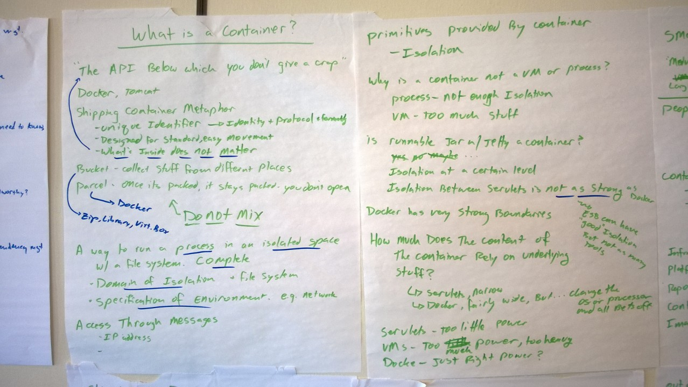
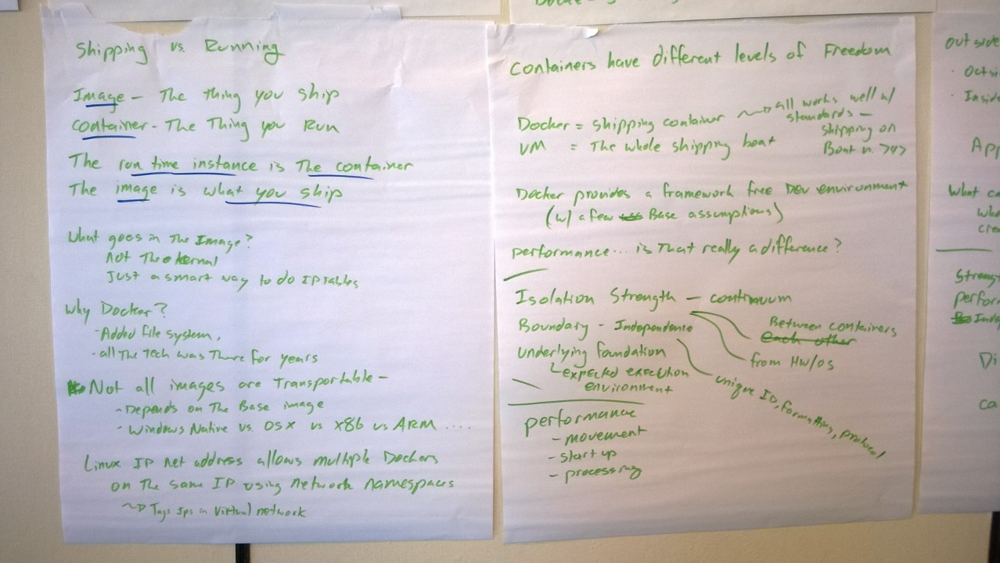
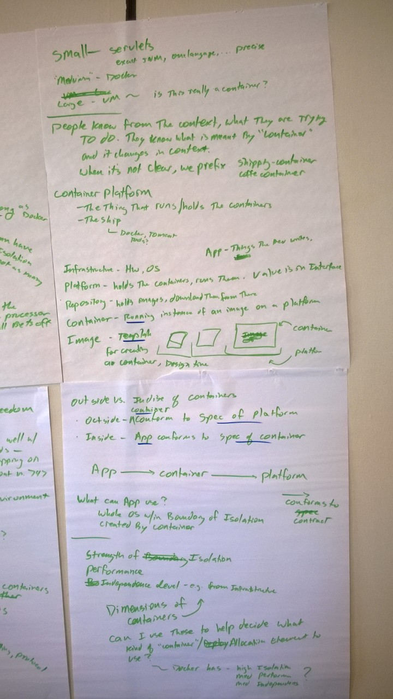

# What is a container

Containers: "The API below which you don’t give a crap" - George
* Examples: Docker, Tomcat


Shipping container metaphor
* Unique identifier -- identity + protocol + formatting
* Designed for standard, easy movement
* **What’s inside does not matter**


How Harold thinks of things
* Bucket -- collect stuff from different places
   * example: Docker
* Parcel -- once it’s packed, it stays packed and you don’t open it.  It’s for shipping only
   * example: Zip, library, virtual box

Definition attempt: A way to run a process in a isolated space with a complete file system
* Domain of isolation
* Specification of environment (e.g. network)
* Access through messages
   * Ip address -- but that’s not the only way to access it

Shipping vs. Running...
* Image -- the thing you ship
* Container -- the thing you run

The run time instance is the container, the image is what you ship

What goes in the image?  Not the whole kernal, just a smart way to do IP tables…

Why Docker?  Of all the tech?
* added the file system
* All the tech was there for years….
* community, tools

Note: Not all images are transportable!
* depends on the base image and the operating system
* Windows native vs. OSX vs. x86 vs. ARM vs ...

Linx IP net address allows multiple Dockers on some IP using network namespaces.  Internally Docker tags IPs in a virtual network

Primitives provided by containers -- Isolation!

Why is a container not a vm or proces?
* Process -- not enough isolation
* VM -- too heavy, too much stuff

Is a runnable jar with jetty a container?
* maybe?  Depends on your point of view
* Isolation at a certain level
* Isolation between servlets is not as strong as Docker
* For example, ESB can have “good” isolation but not as many tools…

How much does the content of the container rely on underlying stuff?
* servlets -- narrow
* docker -- fairly wide, but... change the OS or processor and all bets are off!
* Servlets -- too little power
* VMs -- too much power, too heavy
* Docker -- just the right power?

# Containers have different levels of freedom
* Docker = shipping container (works well with standards - shipping on boat vs 747)
* VM = the ship carrying the containers

Docker provides a framework-free development environments (with a few base assumptions)

Performance... is that really a difference? (With containers)

Characteristics of a container:
* Isolation strength - which is a continuum; between containers and between container and OS
* Boundary - independence (unique ID, formatting and protocol)
* Underlying foundation - expected execution environment

Performance types:
* Movement of containers (images)
* Startup time
* Processing speed

Proposed types of containers:
* Small - servlets (JVM, precise API, ...)
* Medium - Docker
* Large - VMs (is this really a container?)

People do know from the context what they are trying to do.  They know what is meant by “container” and it changes in context.  When it’s not clear we prefix.  Shipping container vs coffee sacks (container).

Container platform:
* The thing that runs (or holds) the containers
* The ship (Docker, Tomcat, tools?)

## Definitions
* Infrastructure - the HW and OS
* Platform - holds the containers, runs them.  Value is on interface.
* Repository - holds images, download them from there
* Container - running instance of an image on a platform
* Image - template for creating a container, design time
* Application - things the developer writes

## Outside vs inside of containers:
* Outside - container conforms to specification of the platform
* Inside - application conforms to specification of the container

```
App -----> Container ------> Platform

A -----> B
A is confined to the contracts of B
```

What can the application use?  The whole O/S within the Boundary of Isolation created by the container.

Dimensions of Containers:
* Strength of isolation
* Performance
* Independence of development (e.g. from infrastructure)

Can I use these dimensions to help decide what kind of “container” / “allocation element” to use?  Docker has high isolation, medium performance (?) and medium independence.






