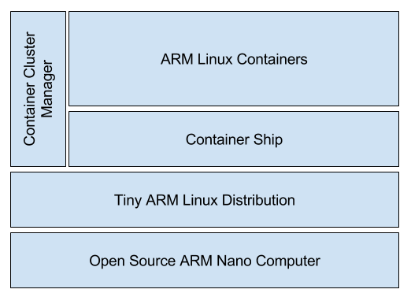
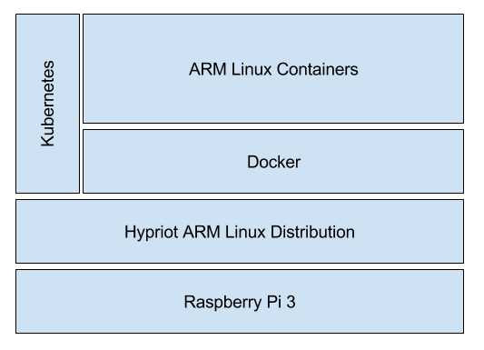
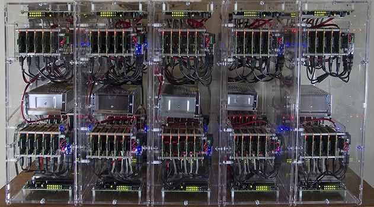

# Cloud-in-a-box 
### Open Source Cloud as an Appliance (OSCA)
#### Dr. Kurt T Stam

Summary - The container has opened the door to running microservices on hardware that is tiny. Together with the ability to schedule and orchestrate these containers across a large number of these small hardware devices, such a device can be described as ‘cloud-in-a-box’. This position paper describes how this new type of computing device is disruptive technology. 

### Introduction
A new era of computing is upon is. This era will bring cloud to the masses in the form of cheap, very reliable Cloud Appliances. These appliances are energy efficient, quiet, reliable, easy to maintain, ultra scalable, and most important incredibly cheap as its basic building block costs $35 US. The low price combined with its stellar capabilities makes this device *disruptive technology* that will be adopted globally in a short amount of time. The hardware and its software are entirely based on Open Source Principles that will keep accelerating the development of the project as adoption of it grows.

### The OSCA Cell
The Open Source Cloud Appliance (OSCA) consist of two or more cells. Each cell consists of a small nano computer running a tiny ARM Linux distribution. The ARM Linux distribution needs to be just enough operating system to support running a container server process, ‘the container ship’, and a container cluster manager process. All other software is deployed inside ARM Linux Containers. As we will show later, the container promise of ‘deploy anywhere’ will play a key role in making cells work together as one appliance.

*Figure 1. An OSCA cell, the single building block of Cloud-in-a-box*

### A current OSCA cell implementation
A number of Open Source technologies have matured over the past year which makes it possible to build an OSCA cell [1] using the following components:

* **RaspberryPi** - Tiny, low cost, computers the size of a credit card or smaller. These devices are small and cheap but their specifications are not. The RPi 3 can be bought for $35, has a 1.2GHz 64-bit quad-core ARM Cortex-A53 CPU with 1Gb of RAM and a microSD card as hard drive. A 16 Gb microSD card goes for about $8. Some other examples are Pine and Beagle Board.
* **Hypriot** - Small Linux distributions that are ‘just enough operating system’ to run a container manager. Some other examples are Raspbian, CoreOS, Pidora and Red Sleeve.
* **Docker** - Container technology running on the linux kernel that wraps up a piece of software in a complete file system that contains everything it needs to run. Another example of this technology component is Rocket by CoreOS.
* **Kubernetes** - Container Cluster Manager to schedule and monitor containers. Some other examples are Docker Swarm.

*Figure 2. An example OSCA cell implementation, using RaspberryPi 3, Hypriot, Docker and Kubernetes*

### Multi-cell Appliance
The size of a cell is approximately a credit card. Multiple cells can be brought together in one casing to form the OSCA appliance. A small appliance would have two to ten cells, which a large appliance can ship with as many as 100 to 1,000 cells. There is already a startup company called pico-cluster (1) that is pioneering this hardware setup, see also Figure 3. Just as Open Source Software commoditized the software market creating a wealth of ready-to-use software components, this Open Source Hardware is doing the same for the physical computing devices providing unified platforms for the OSCA appliance.

*Figure 3. Pico-cluster with 100 RaspberryPi cells.*

##### Low cost 
Each cell is very cheap. There are plenty of low cost nano computers available such as the Raspberry Pi, Pine, Beagle Board etc. that can be used for each cell in this device. These devices cost two orders of magnitude less than conventional computers. The recent Pico computers are yet another order of magnitude cheaper. It is debatable if the current Pico devices are powerful enough to run an OSCA, but it demonstrates the ongoing development and the next generation Pico devices will be more powerful.

##### Low energy use
Each cell is powered by an ARM processor that is designed to be power efficient first, as they are designed to run in mobile phones. The hard drive of the device is microSD card which also draws very little power resulting in an average power usage of about 0.5 W. It is easy to see that even an appliance with 100 cells would only draw 50 W. This could be powered by simple solar cells, with battery backup. Finally, the management system can turn off cells depending on the load on the system.

##### Quiet
Die to the low power consumption, the appliance does not need any forced cooling. This means it can operate without any fans and it does not need any specially cooled server room.

##### Reliability
The most reliable machines are those that are designed for failure. This is exactly what makes this appliance so reliable. Each cell ships with the same exact software. Only a subset of the cells will run as a Kubernetes master,  the rest simply as Nodes. The appliance should have at least two masters so that if one fails the other can take over. Nodes could start their master daemon if the remaining number of masters falls below a certain level.

Masters schedule containers on the nodes. If a node fails, containers are automatically rescheduled on other nodes. A complete cell can be switched out while the appliance is running. 

Appliances do not need a central hosting facility. First off they can run locally in a decentralized fashion. Secondly appliances, or a part of an appliance, can set up as mirrors for other appliances for failover and disaster recovery.

When the density of appliances reaches a certain level they could be configured to communicate peer-to-peer over WiFi protocols, providing an alternative to centralized Internet providers, further increasing reliability of the entire solution.
Scalability

The appliance is a basically a shrunken down Google data center. This configuration is proven to scale by simply adding more cells. The reason this is so easy to do is that the base configuration is all the same. We can easily flash microSD cards with a PXEBoot configuration to enable it to bootstrap itself at the first boot. At that time the base image can be put down and the node will register itself with the Kubernetes master, which will then start scheduling containers on it. It requires very little work and maintenance to scale the appliance itself and it’s just as easy to have multiple appliances join the same cluster.

### Immutable Containers and Micro Service Architecture
At the core of the Appliance’s functioning is the immutable container and Micro Service Architecture. The only reason the appliance can deploy software easily is because of the container providing a deployment platform that is completely isolated. The immutable part of the equation makes it easy to scale the solution by simply starting up more containers. The definition of a Micro Service is simply ‘a software service that has one purpose and one API’. Shipping Micro Services in immutable containers is the perfect solution to deploying applications onto the OSCA appliance. The application as a whole has well-defined API boundaries, which simplifies the development and maintenance of these components. 

Micro Services are about component reuse not code reuse. In this context ‘micro’ stands for having just one purpose and API for the service, it does not necessarily mean ‘small’. For instance, a database hosting one schema could be considered a Micro Service, and as this is shipped in a container with a shared volume (so other containers see the same database data) we can simply fire up more database containers to scale up the database. It would be a mistake, however, to deploy more than one schema in this database as it would violate the ‘One concern, One API’ rule.

### Conclusion
The Open Source Cloud as an Appliance (OSCA) changes the economics and the availability of cloud technology so it becomes viable to be used by everyone. At the heart of the OSCA is Open Source Hardware and Software. The recent developments in container technology allow the use of Nano computers to run lightweight containers to build an appliance ‘cloud-in-a-box’ to run Micro Services. These appliances are energy-efficient, quiet, reliable, easy-to-maintain, ultra scalable, and most important incredibly cheap as its basic building block costs $35 US. The low price combined with its stellar capabilities makes this device disruptive technology that will be adopted globally in a short amount of time. It is poised to have as much of an effect on society as the Internet did 20 years ago.

### References
[1] Kurt Stam - Cluster computing on the Raspberry Pi with Kubernetes - https://opensource.com/life/16/2/build-a-kubernetes-cloud-with-raspberry-pi

[2] Pico Cluster - http://www.picocluster.com/

